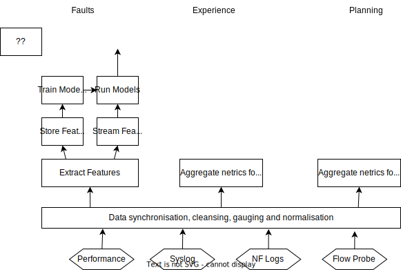

# Network Analytics Use Cases

This section describes the analytics use cases to be demonstrated by this project. A variety of metric collectors are deployed in the free5gc VM, as show in the diagram below. These metric collectors provide the raw data that will drive our network analytics use cases. 

The following metric types are generated: 

* __Performance__: all container compute, memory and network interface performance
* __Syslog__: linux kernel error and warning messages
* __Network Function Logs__: All network function docker logs are scraped and collected
* __Flow Statistics__: User IP and GTP session data is captured.

You can see more details of the [raw metrics](rawmetrics.md) collected here. 

The figure below shows an example 5g network topology deployed in the free5gc VM. 

explain above here

## Network Analytics Use Cases

The following network analytics use cases are demonstrated in this project:

* __Network infrastructure performance__: Is the network infrastructure coping with the service demand, i.e. how hot is it running to deliver acceptable service quality. 
* __Network Faults__: Faults are analysed and correlated with other faults, analysing root cause and next best actions.
* __Customer Quality of Experience__: Ensure Customers are receiving the quality of experience they have paid for. 
* __Anomaly detection__: Identify potential network issues before they happen. 

The figure below shows how which metrics are aggregated to deliver the above analysis.  

The following sections will go into more detail on how the above is calculated. 

### Network Infrastructure performance

Capacity planning use case to make sure there is enough infrastructure to meet the service demand. 

Performance thresholds are set for each application type and an alarm is generated when a flows target  performance is breached

### Network Faults

Identify faults and group together duplicate faults

Perform RCA on what needs to be resolved

Identify the next best action (automated or human)

### Customer Quality of Experience

Performance thresholds are set for each application type and an alarm is generated when a flows target  performance is breached

### Anomaly detection

